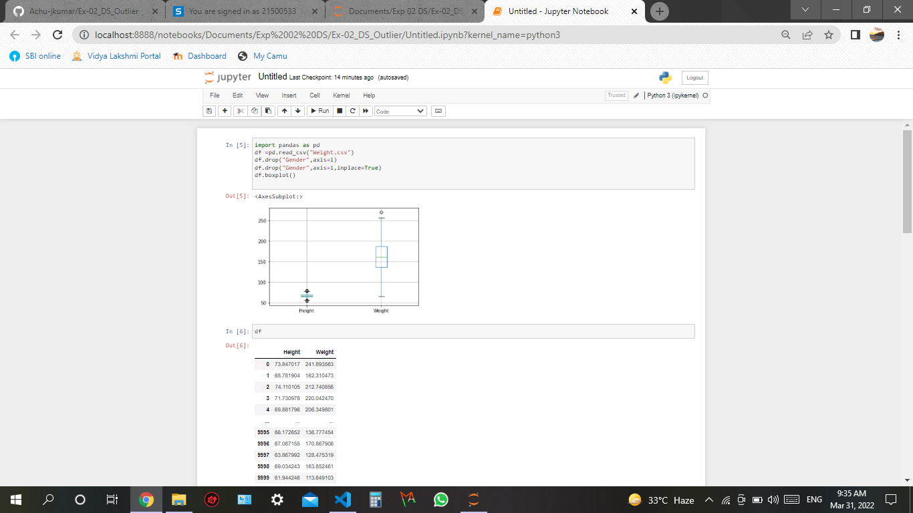
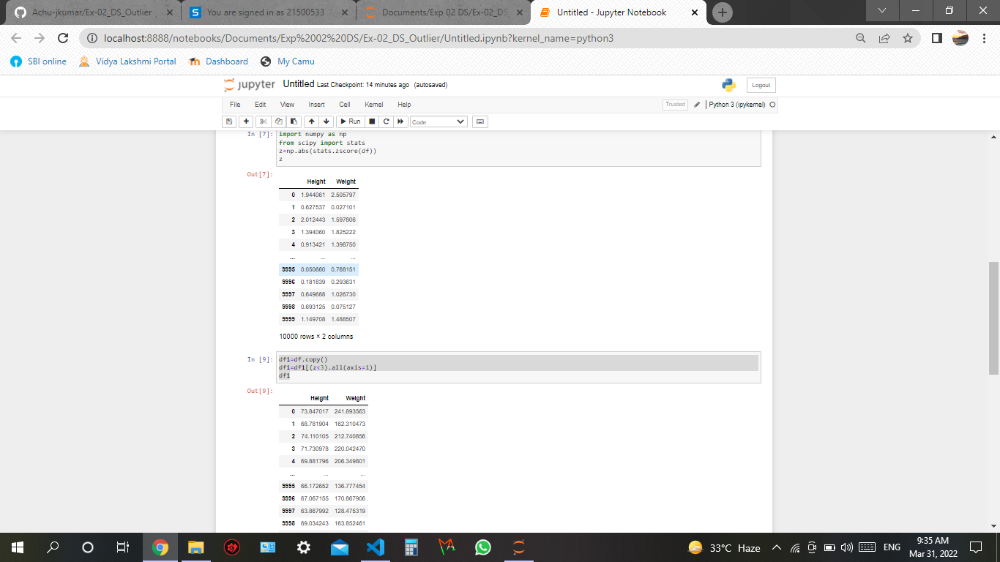
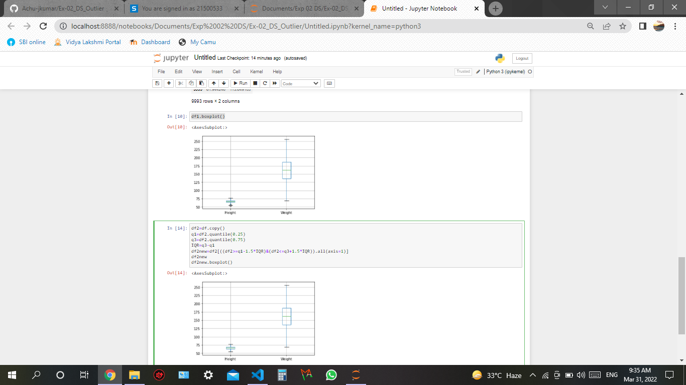

# Ex-02_DS_Outlier
## AIM:
...
## Equipments Required:
....
## Algorithm:
....
## Code:
```
import pandas as pd
df =pd.read_csv("Weight.csv")
df.drop("Gender",axis=1)
df.drop("Gender",axis=1,inplace=True)
df.boxplot()
df

import numpy as np
from scipy import stats
z=np.abs(stats.zscore(df))
z

df1=df.copy()
df1=df1[(z<3).all(axis=1)]
df1
df1.boxplot()

df2=df.copy()
q1=df2.quantile(0.25)
q3=df2.quantile(0.75)
IQR=q3-q1
df2new=df2[((df2>=q1-1.5*IQR)&(df2<=q3+1.5*IQR)).all(axis=1)]
df2new
df2new.boxplot()

```
## Output :




## Result :
 

